# StifleR Dashboards

## Introduction

StifleR dashboards are the window into how data is moving around your network. There are numerous solutions out there that promise to improve network performance, speed up data transfer and save you money. Here at 2Pint we not only make the promise that our products can deliver these benefits, we also prove it by giving you full monitoring and visibility over not only how our software is performing but also over how every bit \(and byte\) of content is moving around your network.

The StifleR dashboards offer an incredibly rich and powerful insight into how data is moving around your network. With real time up to the second monitoring any problems can be immediately identified and investigated. In a matter of minutes StifleR gives you the ability to drill down from a Country level to an individual data stream or client endpoint to quickly analyze issues before they become a threat to business productivity.

Once an issue has been identified you can then use the granular control that the StifleR infrastructure gives you to immediately slow down, suspend or stop any or all data going to a client, a subnet, a site or your entire network. It really is that quick and powerful.

This document is intended to give you a brief idea about the rich information available through the dashboards interface and the drill down information that is available from each of the top level pages. Each offer a different path to follow thus allowing for many logical paths for your network monitoring and troubleshooting activities.

## The Dashboards

### Splash

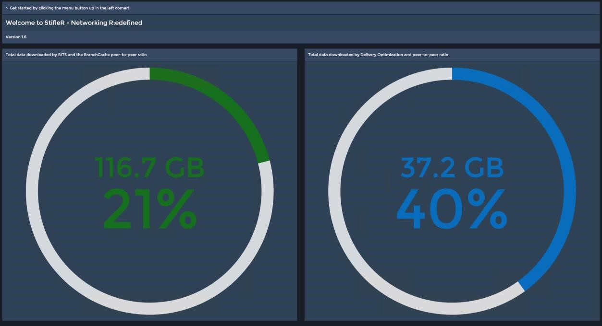

The Dashboards Home Page.

This gives an “at a glance” view of BITS and Delivery Optimization loads and associated P2P download ratios. Clicking on the matrix button in the upper left hand corner accesses the StifleR Dashboard Menu:

### Menu

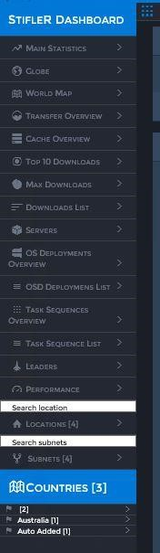

The StifleR Dashboard Menu provides links to the high level dashboards areas of interest. From these overview dashboards various drill down options are available which allow administrators to progressively access more granular information from Enterprise down to an Individual client level.

### Main Statistics

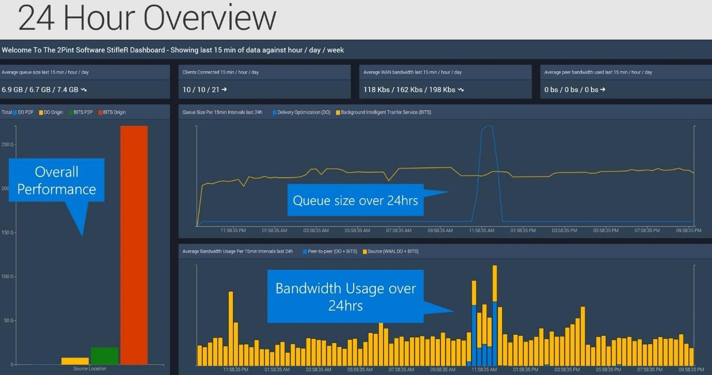

The “Main Statistics” dashboard provides a number of Enterprise level data summaries from the previous 24 hour period.

Various average figures are given for the previous 15 minutes, 60 minutes and 24 hours. These are displayed for:

* Average queue size
* Clients connected
* WAN Bandwidth
* Peer Bandwidth

This page also features a number of graphs which break things down a little more to visualize the Queue Sizes, Total Data and WAN ratios between Delivery Optimization and BITS traffic over the WAN and locally through P2P.

This dashboard does not offer any drill downs.

### Globe

This dashboard allows an at a glance view of some overall Download Statistics based on geographical location. The menu on this dashboard allows you to choose from a number of data sets which are then displayed by location as Spikes on a global map.

You may choose to visualize:

* Active Clients
* Clients
* Bandwidth Used
* Queue and Peer-to-Peer volumes.

This dashboard does not offer any drill downs.

### Transfer Overview

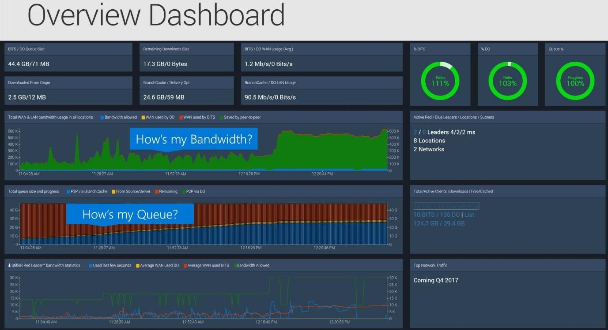

The Transfer Overview dashboard displays statistics associated with data transfer loads. Several figures are displayed as totals which are then split to allow comparisons between BITS and DO loads. There are also several Donut graphs which allow you to compare BITS and DO traffic loads as a percentage of the total queue volume for the Enterprise.

The main display graphs are as follows:

* An area graph shows WAN and LAN utilization along with the amount of bandwidth saved

    through P2P transfers.

* A Bar graph shows various Queue Size and Progress figures
* A line graph allows Red Leader traffic comparisons.

To the right hand side appear a number of figures showing firstly active numbers of Leaders, Locations and Subnets and under this are some totals related to client activity. Several of these figures allow drill downs on:

* Red Leaders - List
* Blue Leaders - List
* Active/Clients - List
* BITS and DO jobs – either Download Overview Dashboard or List
* Cache usage – Cache Overview Dashboard

### 

### Cache Overview

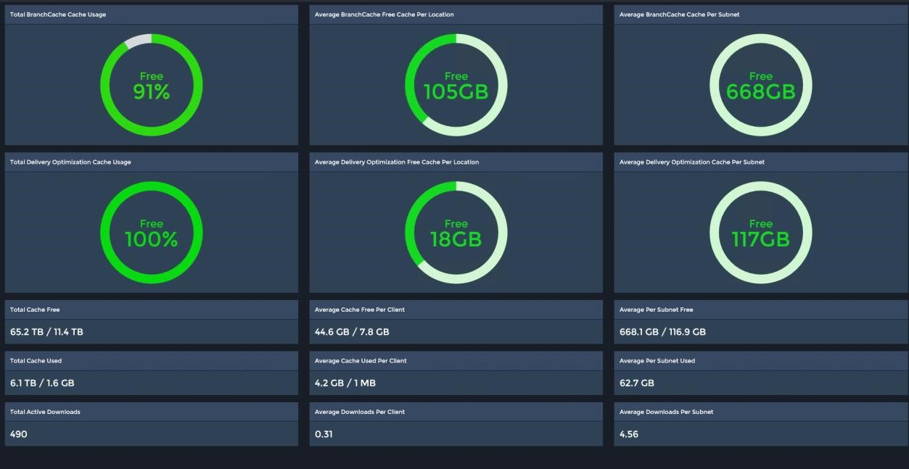

The Cache Overview Dashboard is the place for at a glance information about P2P cache usage overall, by Technology and by Location.

A number of Donut graphs at the top of the page show the Cache space used in Total overall and the Average used per Location and per Subnet for both BranchCache and Delivery Optimization.

Below the graphs are a number of info boxes containing figures that give an overview for the entire Enterprise as well as some averages by Client and by Subnet.

This dashboard does not offer any drill downs.

### 

### Top 10 Downloads

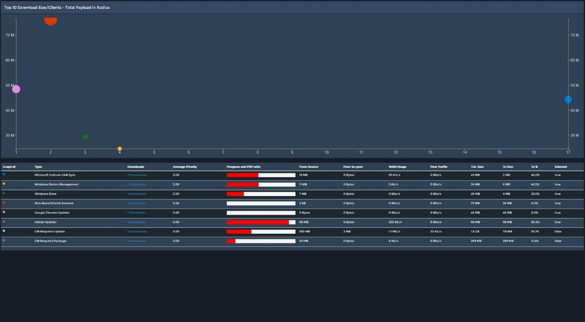

The Top 10 Downloads dashboard shows a bubble graph with each bubble representing an individual download job. The circumference of each bubble represents the total payload of the job with the axis position indicating the download size and the number of clients downloading

Below the Graph appears a list which gives further basic details about each of the download jobs and provides a link for each job to connect through to a list dashboard for that job type. From here it is possible to drill down further to view related dashboards by Location, Subnet and all downloads associated with a particular job type.

### Max Downloads

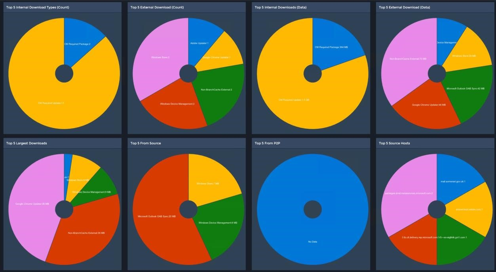

The Max Downloads dashboard provides an at a glance group of Pie Chart graphs that show a number of Top 5 stats. Very useful for instantly getting an understanding of what might be generating the most network traffic both internally and externally and from where that data is being sourced.

The graphs visualize the following:

* Top 5 Internal Download Types \(Count\)
* Top 5 External Download \(Count\)
* Top 5 Internal Downloads \(Data\)
* Top 5 External Download \(Data\)
* Top 5 Largest Downloads
* Top 5 From Source
* Top 5 From P2P
* Top 5 Source Hosts

### 

### OSD

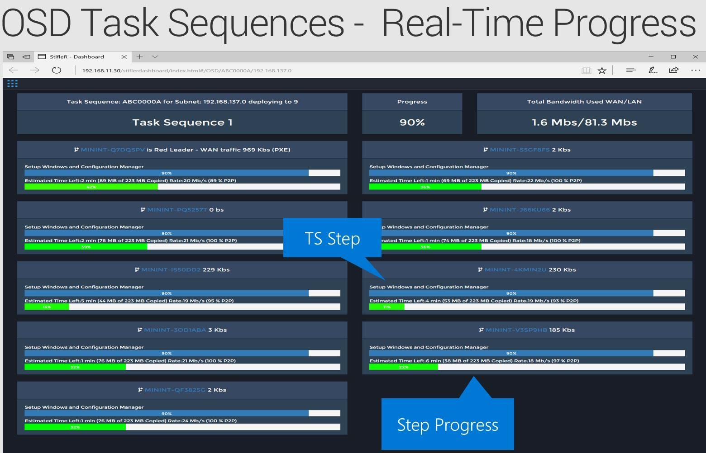

There are two dashboards displaying Operating System Deployment data. The OS Deployments Overview, pictured above and the OSD Deployments List.

The overview dashboard provides invaluable information on all of the OSD jobs currently running in your Enterprise.


Note: In order to gather this granular information you will need to have implemented the 2Pint BranchCache for OSD solution and chosen to add the StifleR client as part of the WinPE image creation.


This dashboard shows overall counts across the top of the number of Task Sequences that are running, the number of clients running task sequences the overall progress and the total WAN and LAN bandwidth being used. Below these figures each Task Sequence is listed along with progress bar charts showing the current Step being executed and the progress of that step.

The OSD Deployments List dashboard gives a complete list of all clients that are running task sequences with drill down available for each allowing you to analyze activity at various levels of the Network from Country down to Subnet.

### 

### Task Sequences

The dashboards for the task sequences are much the same as the OSD dashboards, display the same types of information and offer similar drill down capabilities.

### 

### Leaders

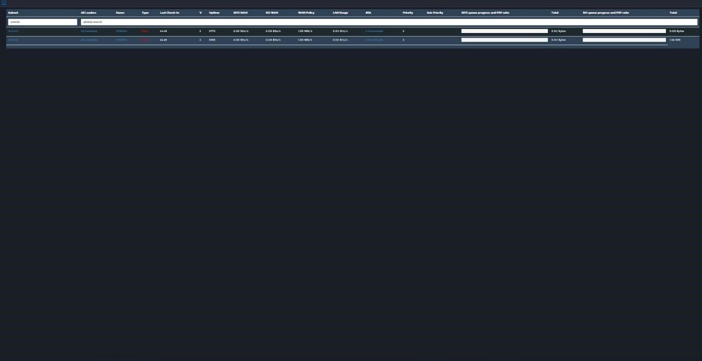

The Leaders dashboard gives a list of all Red and Blue leader machines in your network listed by subnet. Drill downs are available by Subnet, Leaders, Client \(by name\) and Downloads.

For each client the list displays information showing at a glance facts and figures:

* Subnet – IP Address
* All Leaders – link to leaders for the Subnet/Location
* Name – Leader client name
* Type – Color coded Red/Blue
* Last check in
* V – Branch Cache version
* Uptime
* BITS WAN – BITS WAN Usage
* DO WAN – DO WAN Usage
* WAN policy – Allowed Bandwidth
* LAN Usage
* \#DL – Number of downloads for the client
* Priority – Download Priority
* Sub Priority – Multi Lane transfer
* BITS queue progress and P2P ratio – Horizontal Bar graph visual
* Total – BITS total download traffic
* DO queue progress and P2P ratio – Horizontal Bar graph visual
* Total – DO total download traffic

### 

### Performance

The Performance dashboard shows various performance statistics and graphs in relation to the StifleR Server.

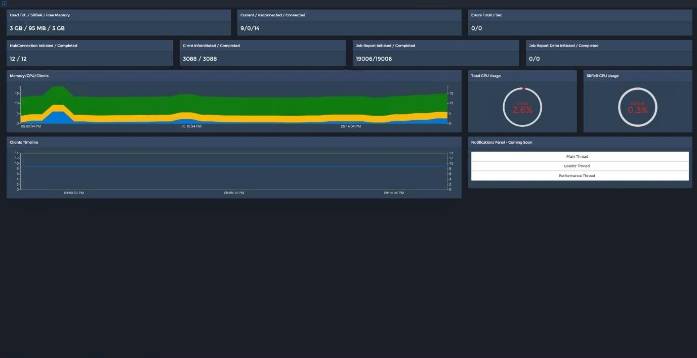

Several counters appear across the top of the dashboard:

* Used Tot/StifleR/Free Memory – gives an indication of how much memory resources StifleR

    is using. \(Rounding errors may cause differences with Task Manager\)

* Current/Reconnected/Connected – Client connection counts give an indication of load
* Errors Total/Sec – Alert indicator
* HubConnection Initiated / Completed – Hopefully the same count for each
* Client Infoinitiated / Completed – Hopefully the same count for each
* Job Report Initiated / Competed– Hopefully the same count for each
* Job Report Delta Initiated / Completed

The two large graphs visualize:-

* Memory/CPU/Clients – area graph giving an indication of Server resource usage alongside

    Client load.

* Clients Timeline – Line graph showing Clients connected over time. These lines correspond

    with the Current/Reconnected/Connected above

Finally there are two donut graphs which give an indication of StifleR load on CPU resources:

* Total CPU Usage
* StifleR CPU Usage

### Locations

Under the Locations drop down in the main menu are listed all of the locations \(searchable\) in your network. Each individual Location has a drop down that allows you to link through to a Location Dashboard and a Location Details page for each.

The Location Dashboard displays the live data for a Location while the Location Details page shows the static details and currently applied settings, Client/Active Clients count, Child Subnet details and drill downs to allow you to jump to the Location Dashboard or the Subnet Dashboard.

The Location Dashboard is of most interest and contains the following information:

Across the top of the page are some info boxes containing various details relating to the Location:

* Location Details – Physical Network and Geographic address details, Active client count,

    Download history and target bandwidth. There is a drill down Settings link that jumps to a

    page which lists in detail the settings that have been applied to the Location.

* Queue and Cache information for Location – Details listed for BITS and DO
* % BITS WAN Usage of allowed bandwidth and LAN usage
* % DO WAN Usage of allowed bandwidth and LAN usage

There are also three Donut graphs:

* %BC – Ratio
* %DO – Ratio
* Queue % - Progress

There are two line graphs on this page:

* Bandwidth usage over time Total/Red Leader – Shows 7 bandwidth history lines:

  * DO P2P
  * DO WAN 
  * BC WAN 
  * BC P2P
  * RL Allowed
  * RL Last Min
  * RL Last 2 Sec

* Latency over time \(only updated on change\)

    o Minimum during period

    o Maximum during period

    o Current

    o Threshold

On the right hand side the Active Child Subnet/Clients/Active/Downloads/Leaders info box provides a count summary and drill downs to allow you to connect to the Leaders or Subnet pages for the Location.

At the bottom right is the Average Latency info box which shows some historical latency counts

### 

### Subnets

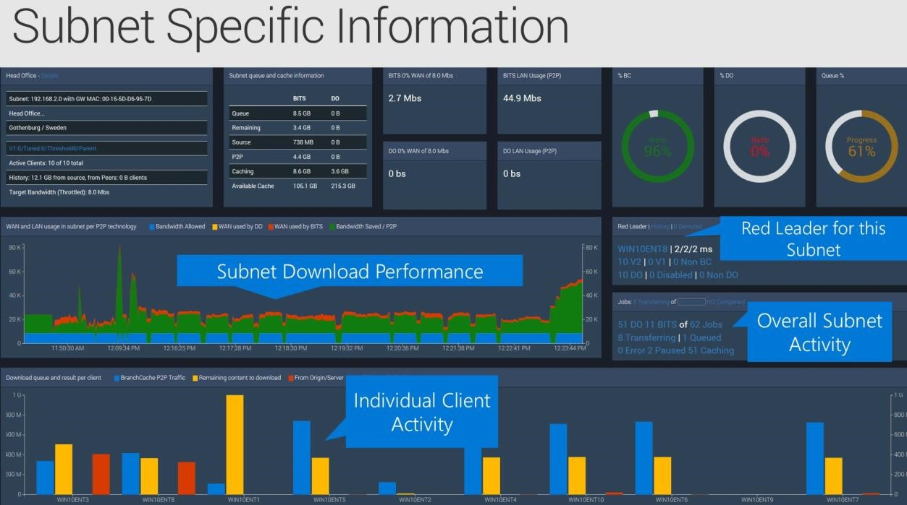

The Subnets drop down on the Main Menu offers a complete searchable subnet list which contains some at a glance summary information for each with a drill down link to each Subnet Dashboard page.

Also in this list are a number of individual featured subnets each of which link through to their subnet dashboard.

The Subnet Dashboard page contains the following information:


NOTE: The information boxes across the top of the dashboard are similar to the Location dashboard. A location may be a single subnet or multiple subnets joined in Parent/Child relationships.


Information boxes across the top of the page:

* Subnet Details – Physical Network and Geographic address details, Active client count,

    Download history and target bandwidth. There is a drill down Settings link that jumps to a

    page listing in detail the settings that have been applied to the Subnet.

* Queue and Cache information for Location – Details listed for BITS and DO
* % BITS WAN Usage of allowed bandwidth and LAN usage
* % DO WAN Usage of allowed bandwidth and LAN usage

There are also three Donut graphs:

* %BC – Ratio
* %DO – Ratio
* Queue % - Progress

There are two main graphs on this page:

* WAN and LAN usage in subnet per P2P technology – Area graph visualizing the following for

    the subnet:

  * Bandwidth Allowed
  * WAN used by DO
  * WAN used by BITS
  * Bandwidth Saved/P2P

* Download queue and result per client – Bar graph visualizing the following for each client
  * DO P2P Traffic
  * Remaining content to download
  * From Origin/Server
  * BranchCache P2P

  

On the left of the dashboard half way up are two info boxes with some summary information along with numerous drill down links. Most of these link to pages containing summary lists and further drill down links.

* Red Leader\|History\|\# Demoted – this heading provides links to the Red Leader dashboard

    and lists for the other two.

  * Red Leader client name \(drill down\) and an allowed bandwidth summary
  * Branch Cache client version and Non BC count
  * DO client numbers and Non DO count.

* Clients: \# Transferring of \# Total, \# Completed Jobs, \# Purged – This heading provides links to

    List pages for each activity count with drill downs available on each

  * DO and \# BITS of \# Total Jobs – Drills down to granular job transfer lists
  * Transferring \| \#Queued – Drill down on each
  * Error \| \#Paused \| \#Caching - Drill down on each

### Drilldown Transfer Lists

The following are some random screen shots showing some of the drill down list pages available on various transfers. This is intended to give you an idea about the granular visibility available through StifleR just in this area of Administration.

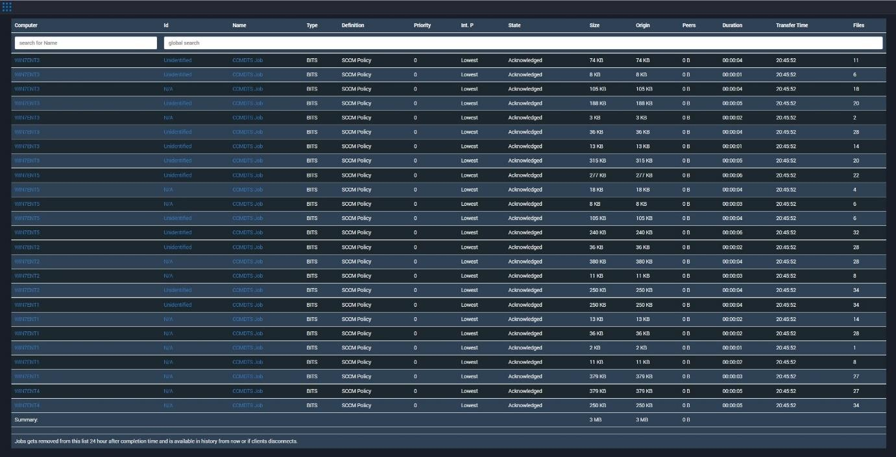

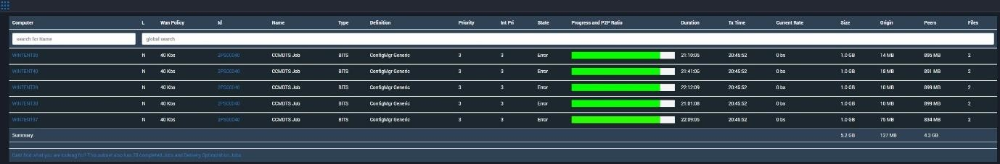

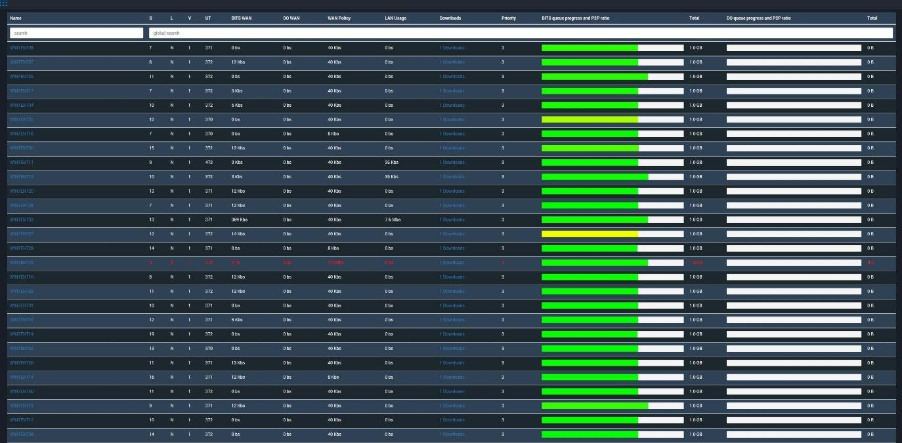

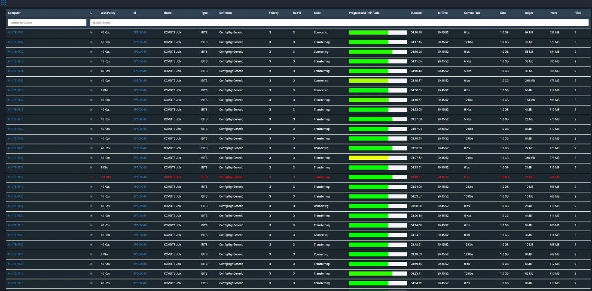

