# Manual Server Installation

### **Manual Server Installation**

The easiest way is to install the server manually using the MSI. The server supports silent installation if needed, but typically you only need to run the installation on a single occasion so automation is not usually required.

#### _Pre-Requisites_

* Requires .Net 4.6.2 to be installed on the server.
* If you want to use the same server to host the dashboards - install IIS as well.
* If you wish to use a Custom App Pool in IIS – create that beforehand
* Installation account must have Administrator rights\(or run the MSI Installer elevated\)
* Ensure you have the License.cab available for the installer to access.
* Firewall – open ports 1414 \(Client comms\) and 9000 \(Dashboard comms\) Inbound for TCP

    traffic

#### _Configure the StifleR Rules XML_ 

The StifleR client will check through its queue of active downloads \(both BITS and DO\) and will prioritize them according to a locally held XML configuration file containing a set of rules that are configured centrally by the administrator and automatically distributed to clients.

This file contains a simple rule set that defines the content download jobs and the priority that the administrator has assigned to each job type. See the StifleR rules definition guide for more details on how to create and configure the rules file. You can use the default rules included with this document for the purposes of testing.

The clients will download the rules definition XML from a configured URL. This URL must be created, and for the purposes of testing we will assume that it is on the same server as StifleR itself.

Place the stiflerulez.xml in the following folder on the StifleR server:

```text
C:\ProgramData\2Pint Software\StifleR\Rules
```

\*\*\*\*

**Create a Virtual folder in IIS** 

From an elevated PowerShell prompt, execute the following command:

```text
New-WebVirtualDirectory -Site "Default Web Site" -Name StiflerRules - PhysicalPath “C:\ProgramData\2Pint Software\StifleR\Rules”
```

This command will create a virtual folder which you will then use during the StifleR client install to configure the clients to automatically update their rules definition. The URL will be:

[http://yourserverfqdn/StiflerRules/stiflerulez.xml](http://yourserverfqdn/StiflerRules/stiflerulez.xml)


_Note: If you do not configure your own internal rules definition file, the clients will default to use on which is stored on the 2Pint website. So, if your clients do NOT have internet access, and you wish to use auto- rules updating then you should configure your own as above._


We are now ready to install the StifleR server component.

### \_\_

### _Installation_ 

From an Elevated Command prompt launch StifleR.Installer64.msi.

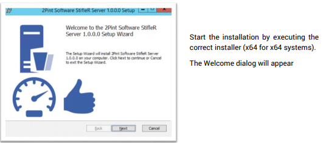

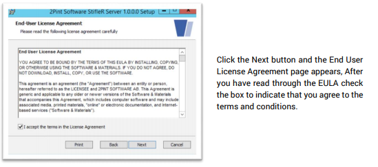

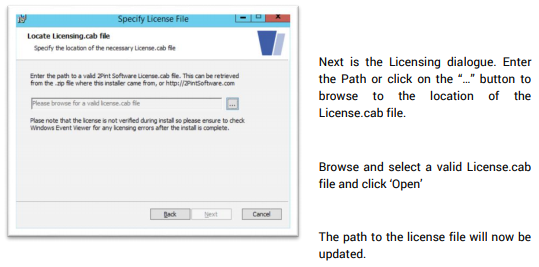


NOTE: If you select an old expired license file the installer will continue but the StifleR service may stop soon after starting.


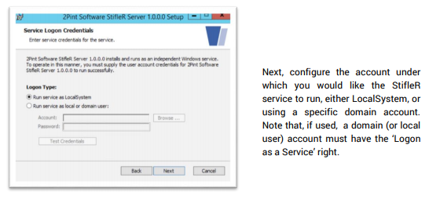

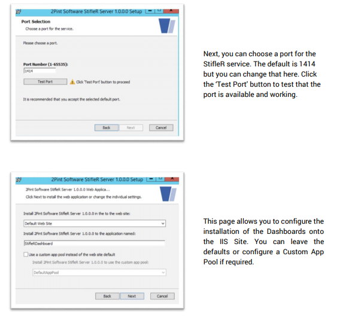

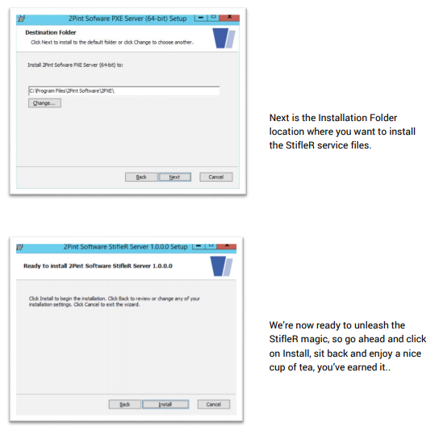

### **Server Installation - Post Installation Checks**

* Check that the service is running - not stopped or in any other state.


* Navigate to the StifleR installation directory.

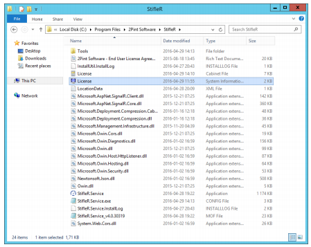

* Check for the License.nfo files. If this is missing the service may not be licensed properly.
* Open up the configuration file \(StifleR.Service.exe.config \) and check that the expected values

  are present. For a detailed description of each value see the Planning and Deployment Guide.

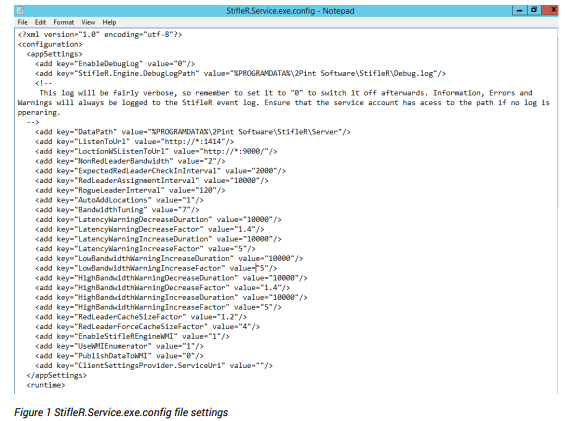

* Open up the Windows Event Viewer MMC and check that StifleR Server events are being

    logged:

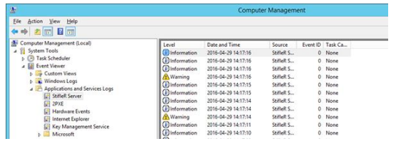

_Ensuring WMI is operational_

* Open up wbemtest.exe and connect to the Root\StifleR namespace.


* Open up the StifleREngine class:

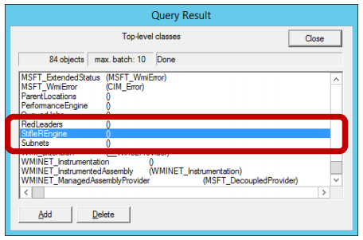

* Ensure you can see the WMI methods:

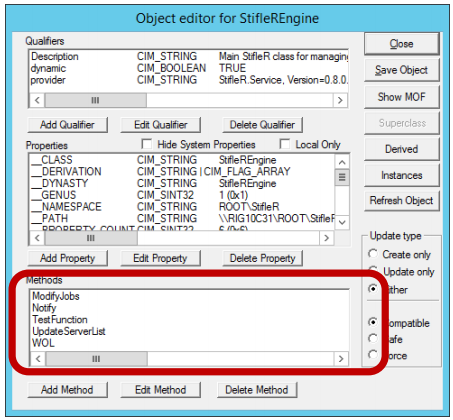

* Hit the Instances button:

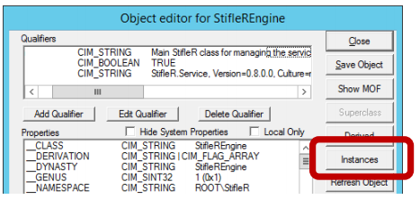

* You should see the default Instance of the StifleREngine with the ID of 1:


* Select this Instance. Scroll down in the properties window. Ensure that LicensedVersion is

    not null and that the other values are similar to those below.

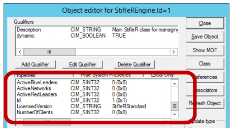

\*\*\*\*

