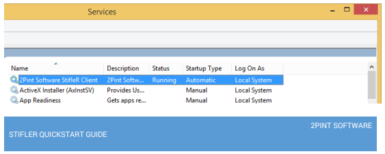

# StifleR Client Installation

### StifleR Client Installation

#### **Pre-requisite**

* Windows 7 SP1 or later
* Supported are x86 or x64 versions of the operating systems
  * Professional, Enterprise or Ultimate versions
  * Newer Educational SKU is also supported

 
* Microsoft .Net 4.6.2 must be installed on the client

The client is a .Net executable with some C++ helper DLLs. It will run on any operating system that is capable of running .Net 4.6 and BranchCache. This includes most operating systems from Windows 7 SP1 and above with the exceptions of Home and other consumer versions of Windows.

#### **Client Modes**

* For the purposes of testing we will be installing the StifleR Client in ’Service Mode’

### **Automated Installation**

You can install the StifleR Client interactively, via the MSI wizard based install. This is described in the StifleR Planning and Deployment guide. For the purposes of expediency and testing however, we will install the client using the MSI command line.

For example:

To install the StifleR Client with default settings, in Windows Service Based Mode with a single StifleR server defined , and the URL for the StifleR rules XML download, run the following command line from an elevated command prompt:

```text
msiexec /i StifleR.ClientApp.Installer64.msi INSTALLTYPE=2 STIFLERSERVERS=http://yourserverfqdn:1414
STIFLERULEZURL="http://yourserverfqdn/StiflerRules/StifleRulez.xml" UPDATERULESTIMERINSEC=”3600” /qn
```

The full table showing the available MSI properties, switches, options and defaults can be found in the Planning and Deployment guide.

### **Post Installation Checks**

_**Service Driven Mode**_

* Check that the 2Pint Software StifleR Client Service is Running



* Check that the service is generating Event log entries to the StifleR event log

\*\*\*\*

